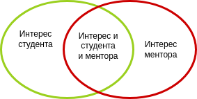

# Темы

(!) **Вы можете предложить свою тему на встрече.**

Ниже список *предполагаемых менторами* тем.

Тема должна быть интересна и вам и ментору,
тогда мы берём её в работу.

###  Исследование проекта Fingerprint

См.: https://github.com/fingerprintjs/fingerprintjs

1. Установка проекта, анализ на различных браузерах
2. Чтение и анализ кода
3. Попытка взломать систему.
4. Доп.идеи для развития системы.

### Исследование проекта Fingerprint-android

Аналогично. см: https://github.com/fingerprintjs/fingerprintjs-android

### Исследование проект DGFraud

См.: https://github.com/safe-graph/DGFraud

1. Сбор и анализ dataset-ов: [стандартные](https://github.com/safe-graph/DGFraud/tree/master/dataset) и другие.
2. Установка проекта, анализ на различных входных данных
3. Анализ контрибьютеров. 
4. Попытка взломать систему.
5. Доп.идеи для развития системы.

### Анализа данных и выявления инсайтов (ретейл)

1. Визуализация данных в сфере ритейла
2. Построения предиктивных моделей для оценки остатков на складах
3. Визуальный анализ рекламных и маркетинговых материалов для кластеризации по категориям
4. Способы анализа данных и выявления инсайтов на основе данных продаж продуктов питания

### Стеганография -- свои идеи

Есть множество мест куда можно прятать информацию. 

Работы наших бывших учеников:
* [Стеганография в файловой системе оптических дисков](https://habr.com/ru/post/449016/)
* [Скрывать не скрывая. Еще раз о LSB-стеганографии, хи-квадрате и… сингулярности?](https://habr.com/ru/post/422593/)
* [Стеганография в файловой системе](https://habr.com/ru/post/347604/)
* [Хэш-стеганография с использованием vkapi](https://habr.com/ru/post/351370/)

Получилось круто и инитересно.

* https://habr.com/ru/post/253045/

Предложите свои идеи, обсудим, подумаем -- поможем реализовать. 

Пользя от стеганографии огромна: можно освоить массу навыков 
для R&D, 
написать интересную статью (которую будут читать),
реализовать маленький, но законченный OpenSource проект.

Статьи ментора можно почитать тут: 

### Стеганография в генеративном исскустве

Интересен синтез стеганографии и генеративного искусства:
* https://habr.com/ru/company/pixonic/blog/429078/

**Задача:** придумать алгоритм, генерирующий изображение, внутри которого сокрыт стеганографический текст

### Исследуем макияж Бакунова 

Принцип GIGO: https://ru.wikipedia.org/wiki/GIGO

Пример принципа GIGI в Data Science: https://news.rambler.ru/other/44146679-chudesa-diagnostiki-slepoe-testirovanie-vyyavilo-koronavirus-u-kozy-i-papayi/

Про макияж Бакунова: https://telegra.ph/Novyj-makiyazh-korolya-07-14

Задача:
1. собрать OpenSource системы распознавания лиц.
2. собрать тестовые данные
3. собрать тестовые данные с макияжем Бакунова
4. оценить работу каждой из систем.

Обучение и оценка:
1. обучение на классических данных, оценка на макияже Бакунова
2. обучение на всех данных

### Анализ трафика. 

Системы:
* https://fingerprint.com/blog/github-projects-fraud-prevention/
* https://alternativeto.net/software/suricata/about/
* https://alternativeto.net/software/snort/about/
* ...

Ставим, смотрим, подаём тестовые данные на вход, оцениваем. 

Пишем своё?

### Криптовалюта

Есть [BaumankaCoin](https://habr.com/ru/post/340206/), 
сделаешь такое же для cвоего вуз-а? :)

Простенький студенческий проект. С исходниками тут: https://github.com/AdPatres/BaumankaCoin

### Исследования в сфере цифровых наличних

Цифровые наличные -- это НЕ криптовалюта!

Трекер по Central Bank Digital Cash:
* https://cbdctracker.org/

Задача:  
1. взять 3-4 разрабатываемых валюты, почитать whitepapers и сравнить.
2. Написать обзорную статью
